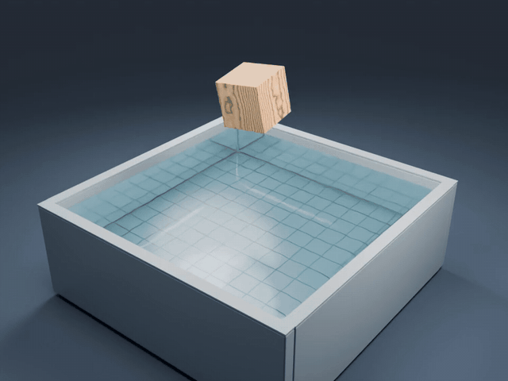
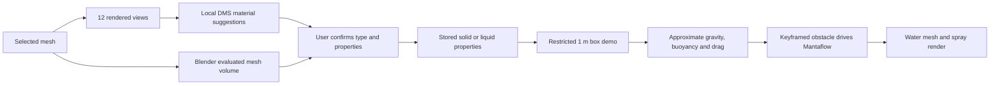

# MaterialFlow for Blender

**From material appearance to editable physics.**

Local AI material suggestions, automatic mesh volume, and a wood-to-water
animation prototype for Blender artists.


[中文说明](README.zh-CN.md) · [Install & setup](docs/SETUP.md) ·
[Download plugin](https://github.com/linjuntian2019-ship-it/materialflow-blender/releases)



[Watch the original 960 × 720, 24 fps demo](docs/media/wood-drop.mp4)

> **Research prototype, not a general solid–liquid solver.** The demo uses
> approximate box dynamics to drive Mantaflow in one direction. Fluid forces
> do not feed back into the solid. Editable liquid properties are currently
> stored as metadata; they are not wired into this demo's dynamics.

## What works today

| Capability | Current behavior |
| --- | --- |
| Local material suggestions | Apple DMS46 segments 12 rendered views; no API account |
| Human confirmation | Suggestions never directly set physical properties |
| Solid properties | Density or mass input; automatic evaluated mesh volume |
| Liquid properties | Editable density, dynamic viscosity and surface tension; metadata only |
| Uncertain appearance | Manual material/type/property entry, including plain gray meshes |
| Wood-drop demo | 1 m solid cube falls, immerses, resurfaces and floats; Mantaflow splash |

The model recognizes **appearance**, not measured density. Wood species,
moisture, cavities and unseen interiors cannot be recovered from a render.
Density presets are illustrative, editable starting values. Pixel shares and
view votes are not confidence scores or recognition accuracy.

## Try it

1. Install the `materialflow-blender-v0.3.1.zip` asset from Releases through
   Blender Preferences → Add-ons → Install from Disk, then enable MaterialFlow.
2. Select a closed mesh. Open the 3D View sidebar (`N`) → **材料物理**.
3. Enter density or mass manually, or configure the optional local AI worker
   using [the setup guide](docs/SETUP.md), inspect its suggestion and confirm.
4. For the water demo, use a 1 × 1 × 1 m cube with applied scale and density
   below 1000 kg/m³ (600 recommended for reproducing the example). Click
   **创建木块落水场景**, save the new scene, then **烘焙液体与水花**.

Manual properties and the demo do not require the AI model. The current UI is
Chinese. Tested on Windows, Blender 5.2.2 LTS and an RTX 4080; the AI worker
currently requires CUDA. CPU/Apple Silicon inference has not been implemented.

## Reproduce the scene

Run from a source checkout, replacing `blender` with your executable if needed:

```sh
blender --background --factory-startup --python-exit-code 1 --python examples/create_demo.py -- --out generated/wood-drop
```

This creates the procedural wood, scene and motion without baking or rendering.
Open the saved `.blend`, enable the plugin and bake using the sidebar. Caches
can exceed 1 GB and are deliberately excluded from the download.

## How it works



Volume uses Blender BMesh `calc_volume`, including evaluated modifiers, object
transform and scene unit scale. The accepted solid is a single closed connected
shell. Self-intersections and physically plausible interiors are not certified.

## Physics & validation

The demo uses uniform gravity 9.81 m/s², water density 1000 kg/m³ and a
voxel-quadrature approximation of buoyancy and drag. Its damping coefficients
are empirical, not a calibrated viscosity model. The featured 600 kg/m³ cube
settles near 60% submerged, as expected from its density ratio. This is a
sanity check, not experimental validation. See [validation](docs/VALIDATION.md).

Arbitrary shapes, sliding entry, heavy sinking objects, bottom contact,
viscosity-driven behavior and two-way coupling are **not supported yet**.
Changing physical settings requires regenerating motion and rebaking fluid;
existing renders do not change automatically.

## Roadmap

- Connect liquid density, viscosity and surface tension to simulation settings.
- Support arbitrary closed shapes, initial velocities and sliding entry.
- Add collision handling and dense solids that settle on the bottom.
- Investigate two-way solid–fluid coupling and quantitative validation.
- Improve uncertain-material handling and recognition evaluation on varied assets.

## Development

```sh
python -m unittest discover -s tests -p "test_*.py"
blender --background --factory-startup --python-exit-code 1 --python tests/blender_smoke.py
python tools/build_release.py
```

Pure Python tests require NumPy. Blender supplies NumPy for its own scripts.
See [third-party notices](THIRD_PARTY_NOTICES.md) for the optional Apple DMS
model and paper. Source license: [GPL-3.0-or-later](LICENSE).
